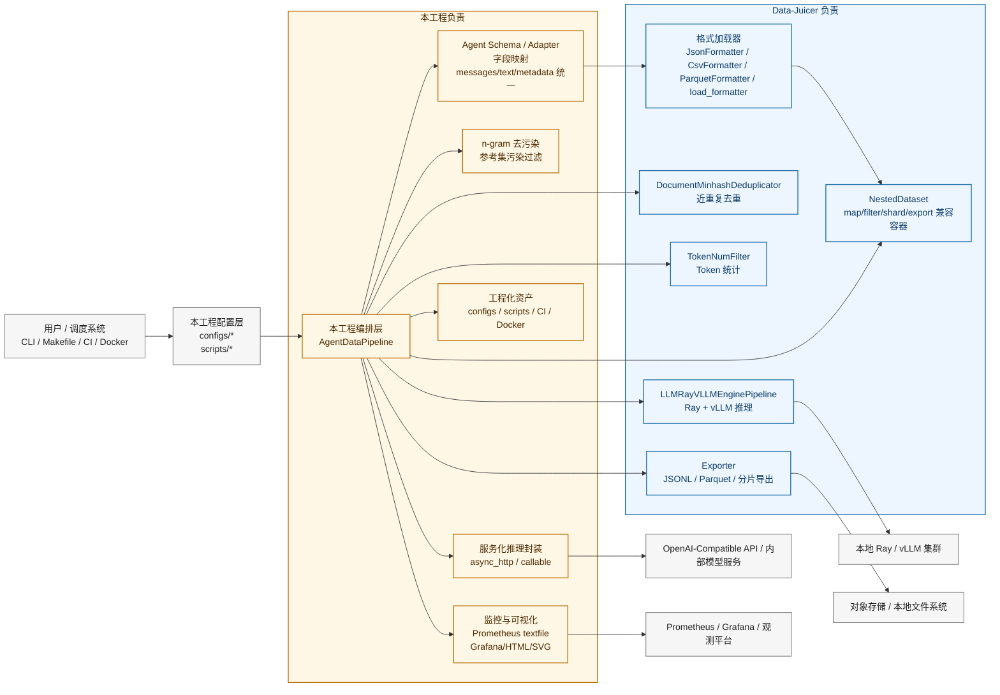

# 本工程 vs Data-Juicer 职责边界图

## 一句话划分

- 本工程：负责 Agent 训练数据的业务语义、企业化运行方式和工程交付。
- Data-Juicer：负责通用数据处理底座能力，能直接复用的算子和组件都直接调用，不重复实现。

## 边界解释

### 本工程负责

- Agent 数据 schema 设计与 adapter 映射
- n-gram 污染过滤
- 非 Ray 场景下的服务化推理封装
- 运行时监控、Prometheus 指标、Grafana 资产、HTML/SVG 可视化
- 配置分层、脚本、Docker、CI、部署骨架

### Data-Juicer 负责

- 多格式数据加载基础设施
- 统一 Dataset 容器和 map/filter/shard 处理范式
- MinHash 近重复去重
- 基于 tokenizer 的 token 统计
- Ray + vLLM 的批量推理 pipeline
- 通用导出能力

## 当前代码对应关系

- 本工程编排入口：`agent_posttrain_pipeline/pipeline.py`
- 本工程 adapter：`agent_posttrain_pipeline/adapters.py`
- 本工程去污染：`agent_posttrain_pipeline/contamination.py`
- 本工程监控：`monitoring/pipeline_monitor.py`
- Data-Juicer 复用桥接：`agent_posttrain_pipeline/dj_bridge.py`
